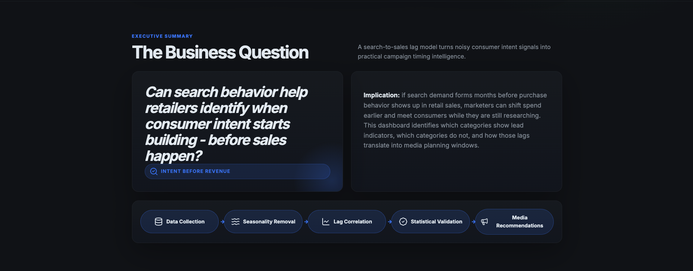
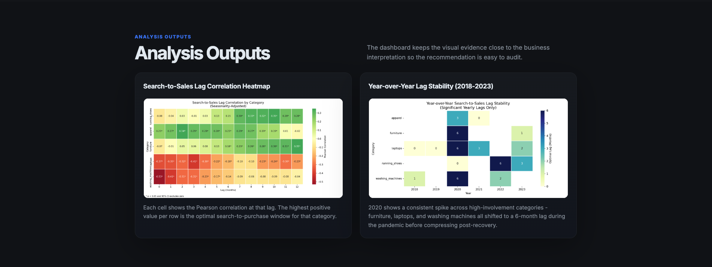

# Consumer Intent Intelligence Platform

> Quantifying the gap between search intent and retail purchase behavior across five product categories.

---

## Executive Summary

This project analyzes whether Google search interest can act as an early signal for retail sales demand. I combined weekly Google Trends data with monthly U.S. Census retail sales, removed seasonality, tested search-to-sales lag correlations, and converted the strongest findings into media planning recommendations.

The result is a business-facing analytics workflow that moves from raw data to statistical validation to an actionable recommendation: when a brand should begin increasing ad spend before a category's historical sales peak.

## Interactive Dashboard

The full analysis is available as a live portfolio dashboard:  
**[View Consumer Intent Intelligence Platform](https://1RakshitRao.github.io/Consumer_Intent_Intelligence/)**

## Platform Preview

## Business Question

Can search behavior help retailers identify when consumer intent starts building before sales happen?

If so, marketers can time campaigns earlier, align spend with demand formation, and avoid waiting until the sales peak is already underway.

## Data And Method

- Google Trends weekly search interest from January 2018 to December 2023, resampled to month-start frequency (`MS`) for alignment with Census data.
- U.S. Census Monthly Retail Trade Survey sales data for corresponding retail categories.
- Weekly search data was resampled to monthly frequency and aligned with monthly sales.
- Annual seasonality was removed using additive seasonal decomposition.
- Pearson lag correlations were tested from 0 to 12 months.
- Findings were filtered using `p < 0.05` and 95% confidence intervals that exclude zero.

## Key Results

| Category | Optimal Lag | Correlation | p-value | Interpretation |
|---|---:|---:|---:|---|
| Furniture | 12 months | 0.350 | 0.000039 | Search interest leads sales by a full planning cycle. |
| Running shoes | 10 months | 0.351 | 0.000033 | Search intent builds well before seasonal sales peaks. |
| Apparel | 2 months | 0.344 | 0.000027 | Shorter search-to-purchase cycle, useful for seasonal campaign timing. |
| Laptops | 3 months | -0.413 | 0.00000037 | Broad search interest does not translate cleanly into sales timing. |
| Washing machines | 0 months | -0.529 | 0.0000000000098 | Search behavior is likely reactive or driven by replacement events. |

Running shoes, apparel, and furniture show positive search-leading-sales relationships after seasonality adjustment. These are the clearest categories where search demand appears to form before sales.

Laptops and washing machines show statistically significant but negative relationships. That makes them analytically interesting: the simple search-lag model may not explain these categories well because purchases are often driven by promotions, urgent replacement needs, product cycles, or offline decision factors.

## 2025 Model Update

The dataset was extended through December 2025 to validate whether original findings held across the post-pandemic recovery period.

Extended dataset covers January 2018 to December 2025, stored as month-start timestamps throughout.

**Key finding: two categories structurally shifted.**

| Category | Original Signal | Extended Signal | Change |
|---|---|---|---|
| Running Shoes | +10 months | +12 months (r=0.64) | Strengthened |
| Apparel | +2 months | Inverse | Flipped |
| Furniture | +12 months | Inverse | Flipped |
| Laptops | Inverse | Inverse | Stable |
| Washing Machines | Inverse | No signal | Dissolved |

The reversal in furniture and apparel is consistent with structural shifts in consumer discovery behavior post-2023 - social commerce, algorithmic recommendation, and same-day delivery normalization appear to have compressed or eliminated the traditional search-to-purchase consideration window in these categories.

**Implication:** Search-intent lag models require periodic structural revalidation, not just data refresh. A model trained on pre-2024 data would systematically mistime furniture and apparel campaigns in 2025.

**Note on marginal extended results:** Apparel (`p=0.048`, `CI upper=-0.0017`) and Furniture (`p=0.050`, `CI upper=-0.0003`) in the 2018-2025 window pass the `p < 0.05` threshold but sit at the boundary of significance. These results should be interpreted as directional signals rather than robust findings - they are sensitive to sample size and warrant revalidation as additional data becomes available.

## Media Planning Recommendations

The project translates the lag findings into a concrete ad timing recommendation table in `data/processed/ad_timing_recommendations.csv`.

| Category | Historical Sales Peak | Search-to-Purchase Lag | Recommended Ramp Start |
|---|---:|---:|---:|
| Furniture | November | 12 months | November of the prior cycle |
| Running shoes | December | 10 months | February |
| Apparel | December | 2 months | October |
| Laptops | December | 3 months | September |
| Washing machines | December | 0 months | December |

This turns the analysis from a descriptive insight into a decision-support asset for campaign planning.

## Statistical Rigor

Every cited lag result passes a significance filter of `p < 0.05` with a 95% confidence interval that excludes zero. The detailed statistical output is saved in `data/processed/lag_results_detailed.csv`.

I also tested whether low-consideration categories behave differently from high-involvement categories. The tier-level t-test did not show a statistically significant difference in optimal lag months (`p = 0.867`), so I would present that result carefully as a directional diagnostic, not a confirmed population-level finding.

## Robustness Check

The year-over-year stability analysis checks whether lag patterns remain consistent across 2018-2023 or shift during unusual periods. Several categories show disrupted yearly patterns around 2020, which is useful context for explaining how consumer behavior changed during the pandemic period.

The stability output is saved in `data/processed/yearly_lag_stability.csv`, with a visual summary in `dashboard/yearly_lag_stability.png`.

## Portfolio Deliverables

- `dashboard/lag_heatmap.png`: headline visual showing lag correlations by category.
- `dashboard/yearly_lag_stability.png`: stability diagnostic across years.
- `data/processed/lag_summary.csv`: statistically filtered optimal lag summary.
- `data/processed/lag_results_detailed.csv`: p-values, confidence intervals, and significance flags.
- `data/processed/ad_timing_recommendations.csv`: category-level media planning recommendations.
- `data/search_lag.duckdb`: DuckDB database with analysis tables and recommendation view.

## Caveat

These results are correlational, not causal. They show timing relationships between search behavior and sales, but they do not prove that search interest causes purchases.
